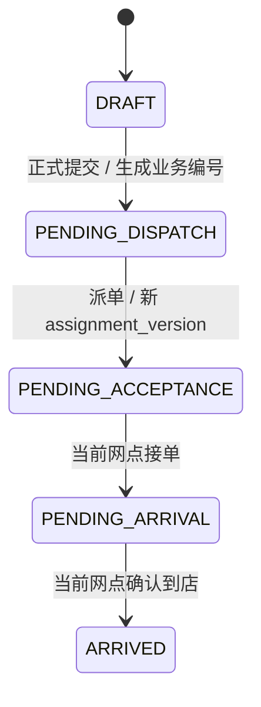
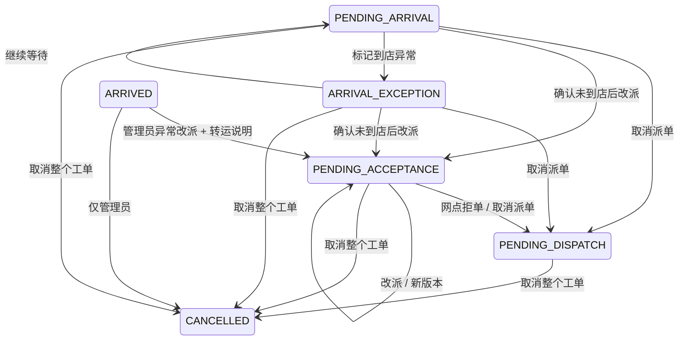

# 业务流程与阶段路线

## 1. 文档用途

本文记录平台正常流程、异常状态流和提示词 1—13 的开发门禁。需求字段与权限以 `REQUIREMENTS.md` 为准，数据定义以 `DATA_DICTIONARY.md` 为准，尚未确认的业务规则只写入 `OPEN_QUESTIONS.md`，不得静默实现。

每个提示词都遵循同一门禁：确认本阶段未决事项 → 只实现本阶段 → 运行相关测试、lint、类型检查、构建和迁移验证 → 更新 `PROGRESS.md` → 汇报并停止。未经用户确认不得进入下一提示词。

## 2. MVP 正常业务流

维修授权必须同时满足：核损单已上传、最终核损金额已录入、保险确认已记录、客服完成平台确认。平台只记录“保险公司 → 平台 → 维修网点”的资金状态，不执行真实付款。

## 3. 阶段 4 正常状态流

- 草稿只有创建客服和管理员可见，可修改、物理删除，不生成业务编号，也不能派单或进入正式待办。
- 正式提交后不能退回草稿，正式工单不能物理删除。
- 每次派单生成新 `assignment_version`；旧版本不能操作当前工单。

## 4. 阶段 4 异常状态流

异常规则：

- 拒单、取消派单、改派、标记到店异常、取消整个工单和关键字段修改都必须填写原因。
- 到店异常可继续等待、取消派单、改派或取消整个工单；系统不自动改变状态。
- 已到店或已产生报价后，只允许管理员取消整个工单。
- 取消必须记录说明以及是否通知车主、网点；当前阶段只记录通知意图，不提前实现站内通知。
- 不提供通用“回退上一状态”。

## 5. 重复、并发与权限流程

正式提交前先串行执行重复检查：

1. 保险公司 + 报案号完全相同属于强重复，数据库唯一约束兜底，禁止创建并返回已有工单号。
2. 同 VIN + 相近事故时间、同手机号 + 同车辆 + 相近事故时间、同保单号 + 同车辆属于建单疑似重复。
3. 同车主 + 同目标网点 + 短期重复属于派单疑似重复。
4. 相近/短期默认 7 天，由管理员配置；疑似重复仅警告，继续操作必须填写原因并审计。

所有状态操作带 `Idempotency-Key`，同时校验工单 `version` 和当前 `assignment_version`。相同键返回第一次响应；重复接单和重复到店在同网点、同派单版本下语义成功，不重复生成状态历史、审计或派单。

服务端数据范围：管理员全部；客服只看本人草稿及全部正式工单；网点只看当前指派给本店的工单；车主只看绑定本人的工单。列表和详情分别应用字段脱敏，不依赖前端隐藏。

## 6. 提示词 1—13 路线与验收

| 提示词 | 范围 | 阶段验收 |
| --- | --- | --- |
| 1 | 工程骨架与本地基础设施 | 三个应用可构建；PostgreSQL/MinIO Compose 配置有效；环境变量无真实秘密 |
| 2 | 登录、用户、角色与数据权限 | 四角色登录和端隔离、RBAC、组织范围、JWT 失效与审计测试通过 |
| 3 | 价格数据库 | 不可变价格版本、原子导入、分页筛选、十万级索引验证和历史保护通过 |
| 4 | 工单、草稿、重复判断与前段状态机 | 正常流、拒单、改派、取消派单、到店异常、取消工单、重复、并发编号、重复操作、旧派单和跨网点测试通过 |
| 5 | 文件、MinIO、Mock OCR 与 Mock 地图 | 文件权限和限制、受控下载、Mock Provider、OCR 人工确认链路可追溯 |
| 6 | 报价、加价、核损与维修授权 | 金额精度正确；报价版本不覆盖；四项授权条件缺一不可；敏感金额不出现在无权 DTO |
| 7 | 维修、收车、评价与投诉 | 未授权不可开工、完工照片门禁、本人收车、评价与独立投诉工单通过 |
| 8 | 回款、结算、导入导出与站内提醒 | 只记录资金、人工结算可空、导入幂等、导出脱敏、通知与待办范围正确 |
| 9 | 调用前端设计 Skill，先设计再开发 | 设计方向、信息架构、关键页面和响应式规范确认，不提前改业务规则 |
| 10 | 管理员与客服管理端 | 管理端所有已实现能力接真实 API，无假页面，权限与错误状态完整 |
| 11 | 维修网点与车主 H5 | H5 完成各自流程；本店/本人和敏感字段边界通过移动端与后端验证 |
| 12 | PDF、Excel 与完整端到端联调 | 文档/表格产物可用，四角色主链路和关键异常链路联调通过 |
| 13 | MVP 最终验收与后期部署准备 | 全部阶段门禁、性能、安全、迁移、备份恢复和部署准备均有证据 |

当前只完成并停在提示词 4；提示词 5 及以后不得因已有设计描述而提前实现。
